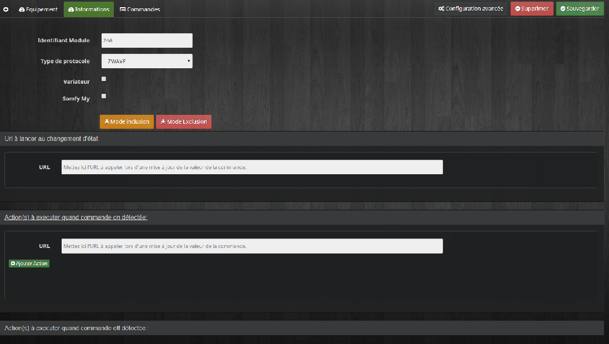
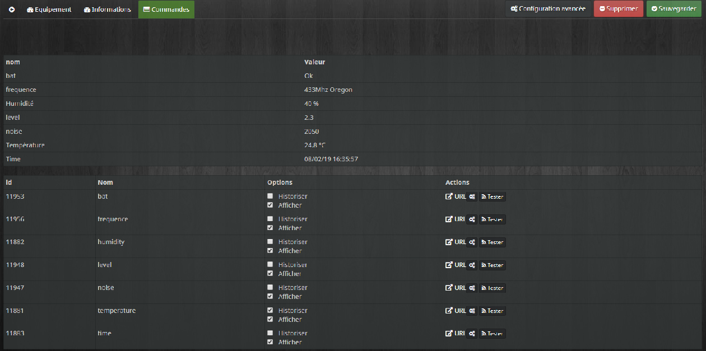
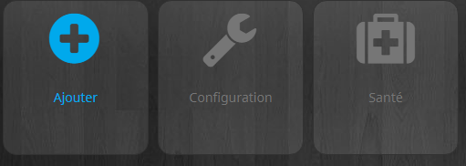
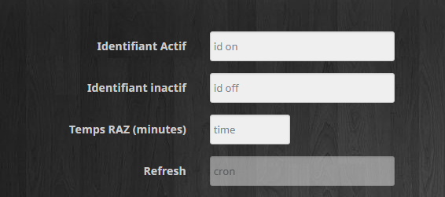
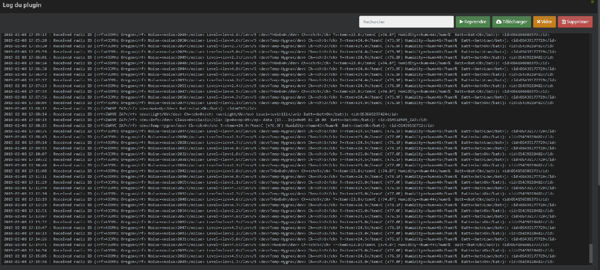
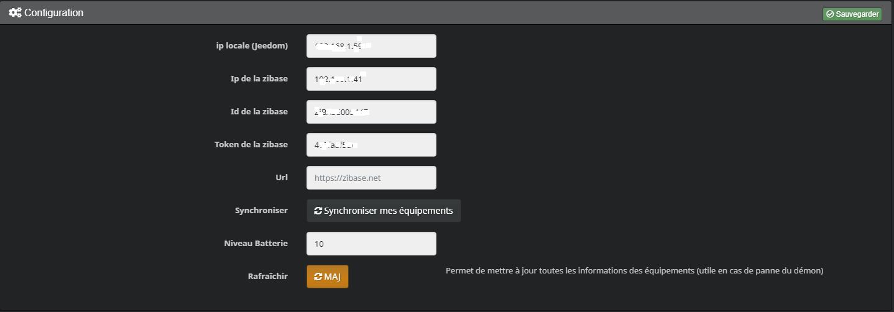

> **UPDATE Fevrier 2019**
>
> Mise à jour importante du plugin pour se préparer à l'arrêt des serveurs . Pas d'impacte sur l'utilisation si vous avez déjà le plugin d'installer. Hormis pour ceux qui ont créé des équipements "custom" avant cette mise à jour. Il faut effacer ces équipements et en créer de nouveaux type "Autres" (Lire la documentation)

Description 
===

Ce plugin permet de récupérer toutes les sondes , actionneurs et sensors de votre zibase (Jusqu'à l'arrêt des serveurs).

Il est aussi possible de créer des équipements depuis le plugin .

Il est ensuite possible d'utiliser ces informations dans Jeedom

Utilisation
===

> **IMPORTANT**
>
> Pour que le plugin fonctionne correctement il faut que les modules aient des ID unique quelque soit le protocole. Sinon cela peut interférer sur la bonne réception des information

Installation
===

* Télécharger le Plugin Jeebase sur le market.

* Activer le Plugin puis remplir les champs de configuration

* **ip locale** : Ip de jeedom

**Enregistrer et créer les données en cliquant sur le bouton "synchroniser"**

> **IMPORTANT**
>
> Il faut attendre au moins 1 minute que le démon se lance

* Aller maintenant dans l'onglet Plugins /monitoring/Jeebase

Vous devriez retrouver tous vos équipements créés lors de la synchronisation.

Configurer l'objet pour qu'il soit visible sur le dashboard et ensuite vous aurez toutes les informations sur le dashboard

Les Actionneurs
===

Les informations
---

* **Identifiant Module** : Identifiant qui doit être unique
* **Protocole** : Le protocole du périphérique
* **Variateur** : Cocher si dimmer
* **Somfy my** : Cocher si protocole somfy rts . Cela créé la commande my qui a 2 fonction: arrêt si le store est en mouvement ou positionnement à la position préférée

Possible aussi d'effectuer des actions lorsque la commande est reçu

* **URL** : Remplir le champs avec  une url valide (Utile en cas d'autre solution domotique par exemple)

Les Commandes
---

> **NOTE**
>
>  La table des commandes se remplie au fur et à mesure que le plugin reçoit les information

Les sondes
===

Beaucoup plus de commandes que les actionneurs.

* **bat** : état de la batterie (Low ou OK)
* **Level** : Niveau de réception RF (1 à 5 )
* **Noise** : Bruit

> **NOTE**
>
>  La table des commandes se remplie au fur et à mesure que le plugin reçoit les information
>
> En cas de changement de pile , l'id peut changer. Il faut activer le mode debug et regarder le relevé d'activité. Changer l'id si besoin dans l'équipement . Ne pas oublier de remettre les logs par défaut si plus de nécessité.

Les Détecteurs (sensors)
===

> **IMPORTANT**
>
> Certains détecteurs(selon protocole mais zwave OK) ne remontent pas leur état. Pour cela reportez-vous aux équipement autre

Les équipements "Autres"
===

En plus des actionneurs,sondes et détecteurs il est possible de créer des équipements personnalisés. Cela peut-être utile pour:

- Créer des actionneurs personnalisés
- Créer des détecteurs "particulier" ==> avec un id ou 2 ids 

Pour cela cliquer sur le plus et choisir "Autres" dans la liste déroulante . Ne pas oublier de donner un nom à l'équipement.

L'équipement apparaît ensuite dans la liste. Aller dans l'onglet information

* **Identifiant Actif** : Correspond à la commande ON d'un actionneur
* **Identifiant inactif** : Correspond à la commande OFF d'un actionneur (Ce Champs peut ne pas être rempli) . Utiliser le champs en dessous pour positionner l'équipement en position OFF 
* **Temps RAZ (minutes)** : Durée aprés lequel l'actionneur se positionnera en position OFF ( Utile pour les détecteurs avec un seul ID)
* **Refresh** : Dernière RAZ ou prochaine si activé

> **IMPORTANT**
>
> Les ID sont uniques. Donc il ne faut pas qu'un autre équipement utilise le même ID sinon cela va retourner des valeurs erronées

Les Logs
===

> **IMPORTANT**
>
> En mode *Debug* le plugin est très verbeux, il est recommandé d'utiliser ce mode seulement si vous devez diagnostiquer un problème particulier , rechercher un ID , en mode inclusion/exclusion
>
> Il faut redémarrer le démon aprés tout changement pour que cela soit effectif

Le log jeebase_php
---

Il est correspond au suivi d'activité de la zibase et n'est rempli que losque le mode debug est activé. C'est le plus important

Pour ouvrir la fenêtre aller dans la configuration générale du plugin et cliquer sur le bouton jeebase_php

Gestion des batteries
===

La zibase ne renvoit que 2 états Low et OK.

La gestion des batteries passent par jeedom.

Pour cela il faut aller dans la configuration générale via la roue crantée en haut à droite puis configuration.

Dans l'exemple ci-dessus j'ai placé le niveau d'alerte sur 15. Si vous avez d'autres valeurs ne rien changer. 

Ensuite aller dans la configuration du plugin

Et remplir le champs concernant la batterie. ici j'ai mis 10 , une valeur inférieur au niveau warning (15 précédemment)

Ajouter un équipement
===

> **IMPORTANT**
>
> Pour rappel , l'ID doit être unique quelque soit le protocole. Sinon cela peut interférer sur la bonne réception des information

Depuis la zibase
---

- Suivre la procédure habituelle et une fois terminée ,synchroniser les équipements dans la configuration générale du plugin

Depuis le plugin
---
> **IMPORTANT**
>
> Bien suivre les étapes pour la réussite de l'opération. Pour rappel l'id doit être unique dans le plugin

###Inclusion###

* Créer un équipement
* Choisir l'id et le protocole

> **IMPORTANT**
>
>Pour le Zwave il ne faut pas d'ID car sera déterminé par le controleur
>
>Pour les périphériques somfy , il faut choisir les identifiants C1 à C16 et/ou D1 à D16
>
>Pour les périphériques X2D, il est conseillé d’utiliser les groupes A1 à A16 et/ou B1 à B16

* Enregistrer la configuration

* Déroulement de l'inclusion 

**Si besoin , Appuyer sur le bouton d’apprentissage du récepteur. (voir procédure selon protocole)**

**Cliquer ensuite rapidement sur le bouton inclusion de l'équipement**

* Récupérer les informations

Hors Zwave: Votre module doit être inclus . Vous pouvez l'utiliser dans jeedom.

Zwave : Il faut récupérer l'id que vous allez voir dans le relevé d'activité et l'ajouter à l'équipement. Certains modules permettent de récupérer la température , l'humidité , la luminosité. Idem lors de la confirmation les ids sont notifiés. Il faut en plus créer des équipements(sondes en générale) avec l'ID récupéré

* Terminer le processus

> **IMPORTANT**
>
> Aprés la fin de/des inclusions , il est nécessaire de cliquer sur le bouton "terminer" pour retrouver le niveau de log d'avant le début de l'inclusion

###Exclusion (Zwave seulement)###

* Aller sur l'équipement à exclure et cliquer sur bouton "Exclusion". La zibase se met en mode exclusion

* Effectuer les actions spécifiques au module.

* Le relevé d'activité confirme la bonne réussite de l'opération.

> **NOTE**
>
> Si vous n'avaz pas de module Zwave et voulez l'exclure , il faut créer un équipement , ne pas mettre d'id mais le protocole "Zwave" . Enregistrer puis cliquer sur exclusion.

Troubleshooting
===

Le démon ne démarre pas
---
- Vérifier que les informations de connexion sont exactes
- Vérifier les logs jeebase ,jeebase_php , http.error pour contrôler s'il y a une erreur

Détecteur ne remonte pas l'information
---
- Se référer aux chapitres sur les équipements "Autres"

Je ne connais pas l'ID de mon module
---

- Utiliser le mode debug (se référer aux chapitres sur les logs) puis activer/stimuler le pour vérifier les informations dans les logs jeebase_php

Le forum
---

- Pour toutes questions , ne pas hésitez à poster sur le fil officiel du plugin 
[Cliquer ICI](https://www.jeedom.com/forum/viewtopic.php?f=184&t=2471)

